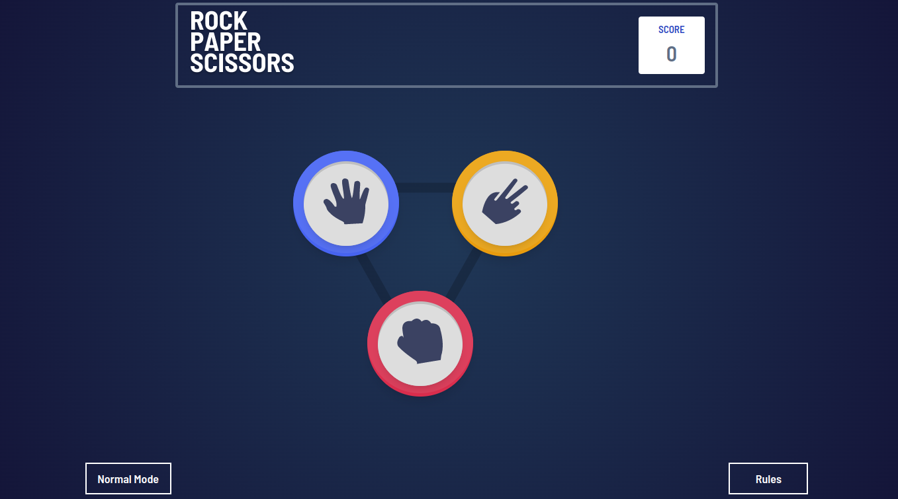
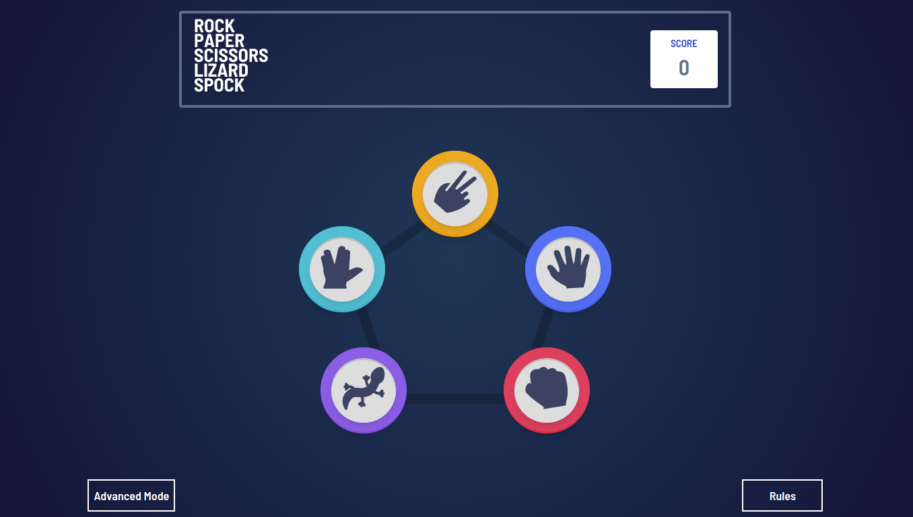
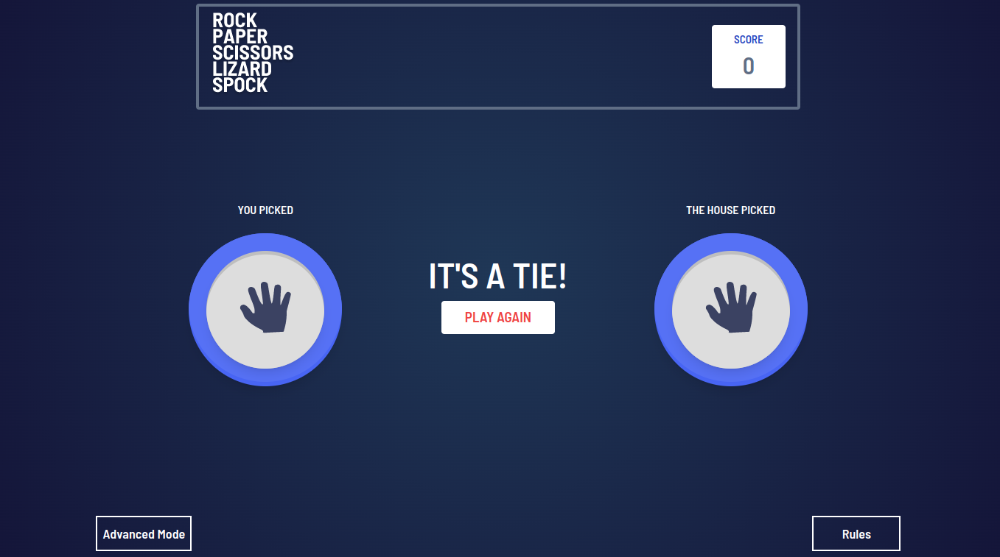
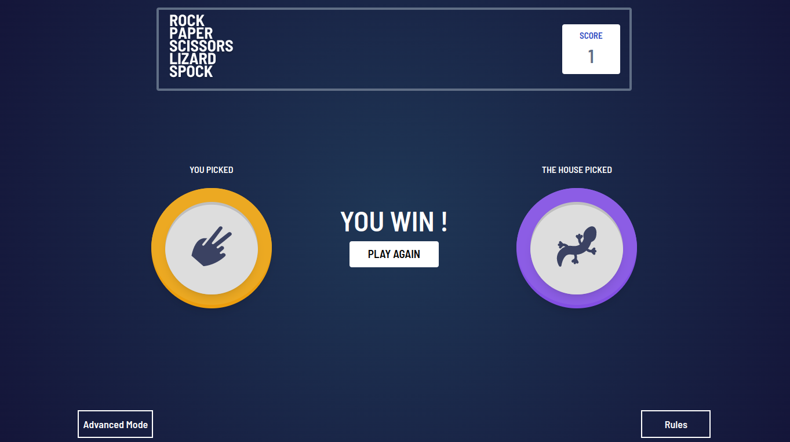
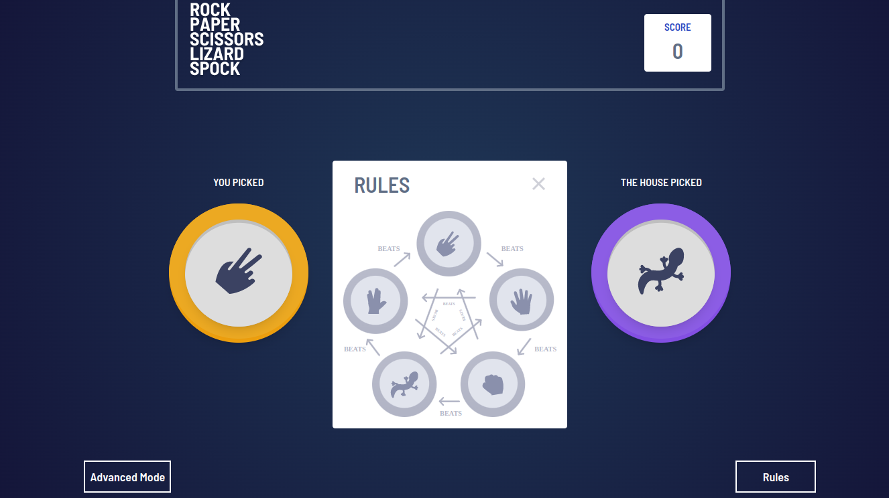

# Frontend Mentor - Rock, Paper, Scissors solution

## Overview
Rock , Paper , Scissors game as commonly referred is one that evaluates which is greater than the other based on some common shapes , the Rules for the game and the playing Processes are indicated in the web application.

### The challenge

Users should be able to:

- View the optimal layout for the game depending on their device's screen size
- Play Rock, Paper, Scissors against the computer
- Maintain the state of the score after refreshing the browser _(optional)_
- **Bonus**: Play Rock, Paper, Scissors, Lizard, Spock against the computer _(optional)_

### Screenshot

### Links

-  Solution URL: [Add live site URL here](https://your-live-site-url.com)
-  Live Site URL: [https://unrivaled-lily-b793c7.netlify.app/](https://unrivaled-lily-b793c7.netlify.app/)

### Built with

- [React](https://reactjs.org/) - JS library
- [Next.js](https://nextjs.org/) - React framework
- TailwindCSS

## Author

- Frontend Mentor - [@jerncomania28](https://www.frontendmentor.io/profile/jerncomania28)
- Twitter - [@okonjeremiah4](https://www.twitter.com/okonjeremiah4)
